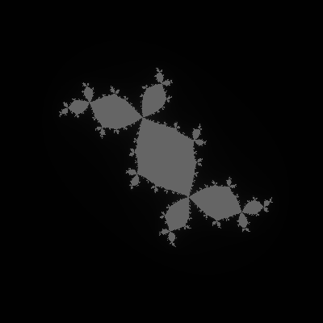

# Risc-v fractal generator by Tomasz Okoń

# Running the program
-   To run the program use a risc-v simulator like RARS https://github.com/TheThirdOne/rars

# What does it do
-   It takes two arguments (width, height) passed by console.
-   Generates predefined Julia fractal on already existing bitmap (in this case test.bmp)

